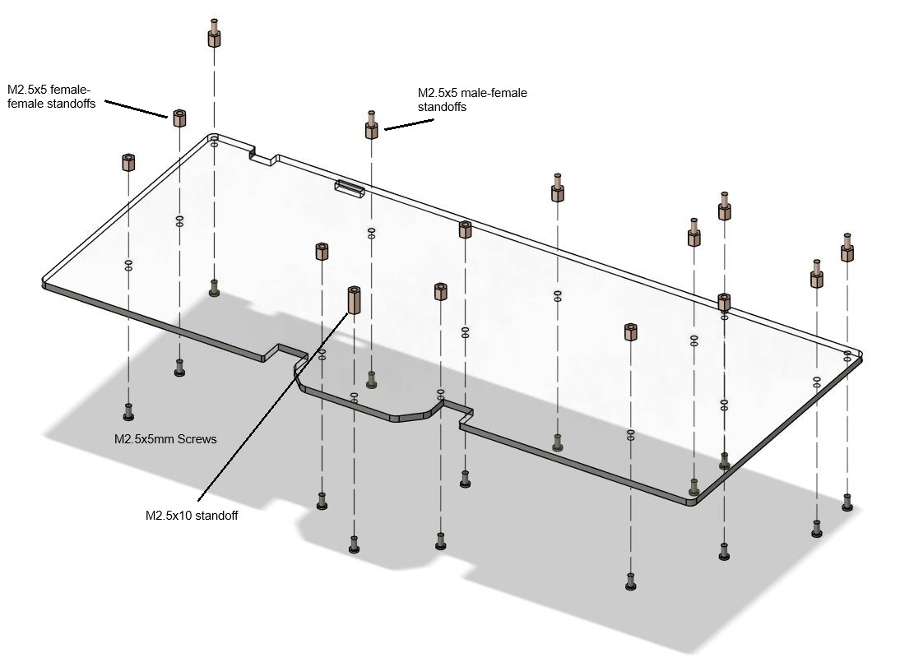

# V2 Build Instructions

## Necessary Parts

| Image                                                                             | Part Name                        | Count |
| --------------------------------------------------------------------------------- | -------------------------------- | ----- |
|                 | M2.5x1.5mm washer                | 3     |
|   | M2.5x6mm standoff female-female  | 7     |
|  | M2.5x10mm standoff female-female | 1     |
|     | M2.5x5mm standoff male-female    | 7     |
|   | M2.5x5mm standoff female-female  | 7     |
|                    | M2.5x4mm screw                   | 8     |
|                    | M2.5x5mm screw                   | 22    |
|                                      | Top acrylic bar                  | 1     |
|                                      | Bottom acrylic panel             | 1     |
|                                      | Acrylic switch plate             | 1     |
|           | 5 pin female pin header          | 2     |
|             | 4 position DIP switch            | 1     |
|                      | Slide switch                     | 1     |
|                      | 1N4148 diode                     | 84    |
|         | 0.01uF 1206 SMT capacitor        | 2     |
|         | 330Ω through hole resistor       | 1     |
|         | 10kΩ through hole resistor       | 4     |
|                   | 2x20 pin header                  | 1     |
|                    | SSD1306 screen                   | 1     |
|               | EC11 rotary encoder              | 1     |
|                                      | PCB                              | 1     |
|                    | Hotswap socket                   | 66    |
|                                      | Pi Pico                          | 1     |
|                                      | Pi Zero / Zero 2                 | 1     |

## You Also Need

- Soldering iron. Conical tip is recommended.
- Solder wire. Thin solder wire with less than 0.03 inch diameter is recommended.
- Tweezer.
- Wire cutter to remove diode pins.
- Tape or hot glue gun.
- Key switches.
- Key caps.
- Stablizers.

## PCB Assembly

### Recommended Assembly Order

1. Diodes
2. Hotswap sockets
3. Resisters
4. Capacitors
5. Pi Pico
6. 5 pin female header + DIP swtich + slide switch
7. Rotary encoder
8. Pi Zero + 2x20 pin header

### Solder Pi Zero 

1. Secure Pi Zero to the PCB using two pairs of male-female and female-female standoffs, as such:

   
   

2. Tape down the pin header

   

   You can also use hot glue. Just be careful not to cover the small components on Pi Zero. Remove the tape when soldering the pins it covers. The pins can conduct the heat and melt the tape.

3. Solder the pin with the keyboard PCB and the Pi Zero:

   

   Bring in the soldering iron vertically, and press the tip againt the pin, the keyboard PCB and the Pi Zero PCB. Hold for half a second to a second to heat up the pads. Then feed in the solder wire from the left, touching the pin and the pads:

   

   Tip: use thin solder wire with less than 0.03 inch diameter. 

4. Remove the standoffs. 

### Solder the Diodes

Make sure the cathode band is aligned with the square pad:


### Solder Hotswap Sockets

1. Tin one of the pads:

   

2. Place the socket, and solder the tinned pin:

   

   Place the tip of the soldering iron as shown and press down. You might also want to use a tweezer to press down on the other pin.

3. Solder the other pin.

### Solder the SMD Capacitors

The process is similar to the hotswap socket. Capacitor doesn't have any polarity.

1. Tin one of the pads.
2. Use the tip of the soldering iron to melt the tin, and slide in the capacitor.
3. Solder the other end.

This [video](https://www.youtube.com/watch?v=_DsCdOaRUPM) is a nice demonstrateion.

## Frame Assembly

### Step 1


Install the standoffs to the bottom panel. All the screws used here are M2.5x5mm. There are 7 M2.5x5 male-female standoffs for the top part of the panel, and 7 M2.5x5 female-female standoffs for the lower part.

### Step 2


Install the standoffs to the bottom panel. All the screws used here are M2.5x5mm. There are 7 M2.5x5 male-female standoffs for the top part of the panel, and 7 M2.5x5 female-female standoffs for the lower part.

## Build Software

### Pi Pico Firmware

Install build dependencies:

Arch Linux:
```bash
pacman -S git cmake arm-none-eabi-gcc
```

For other distros or OS, see https://github.com/zli117/PicoMK#get-the-code

Check out the code:
```bash
git clone https://github.com/zli117/PicoMK.git
cd PicoMK
git submodule update --init --recursive
```

The hardware configuration for this keyboard is defined in `configs/cyberkeeb_2040` dir in `PicoMK`. You can take a look at the [`layout.cc`](https://github.com/zli117/PicoMK/blob/main/configs/cyberkeeb_2040/layout.cc) for the details on the keymap.

Build the firmware:

```bash
mkdir build
cd build
cmake -DBOARD_CONFIG=cyberkeeb_2040 ..
make -j 4
```

If successful, you can find the `firmware.uf2` file in the build dir. Now, hold down the flash button on the Pico and plug it in. It will show up as a USB drive. Just copy the `firmware.uf2` file to the drive.

### Pi Zero Kernel Module

To send the keycodes to the Pi Zero, a kernel module is needed on the Pi Zero side, as it uses a custom [protocol](https://github.com/zli117/PicoMK/blob/main/docs/ibp.md) defined over SPI.

For this you'll need an external keyboard. 

1. Install kernel headers: `sudo apt install raspberrypi-kernel-headers`
2. Checkout PicoMK `git clone https://github.com/zli117/PicoMK.git`.
3. Build the driver and device tree overlay:
```bash
cd PicoMK/linux
make -j
make device_tree
```
4. Install the driver:
```bash
sudo -E make install
sudo depmod -a
```
5. Copy over the device tree overlay: `sudo cp spi1-picomk.dtbo /boot/overlays`.
6. Add this line to the `/boot/config.txt`. Make sure SPI1 is not enabled.
```
dtoverlay=spi1-picomk
```
7. Add this line to the `/etc/modules` file:
```
spi_picomk
```

If you update the Raspberry Pi OS, especially with kernel updates, you'll need to rebuild the kernel module (rerun step 4).

If you want to use the 3.5 inch GPIO TFT screen, and you're on Pi Zero, install the driver from https://github.com/juj/fbcp-ili9341. If you're on Pi Zero 2, install the driver from https://github.com/goodtft/LCD-show.  
