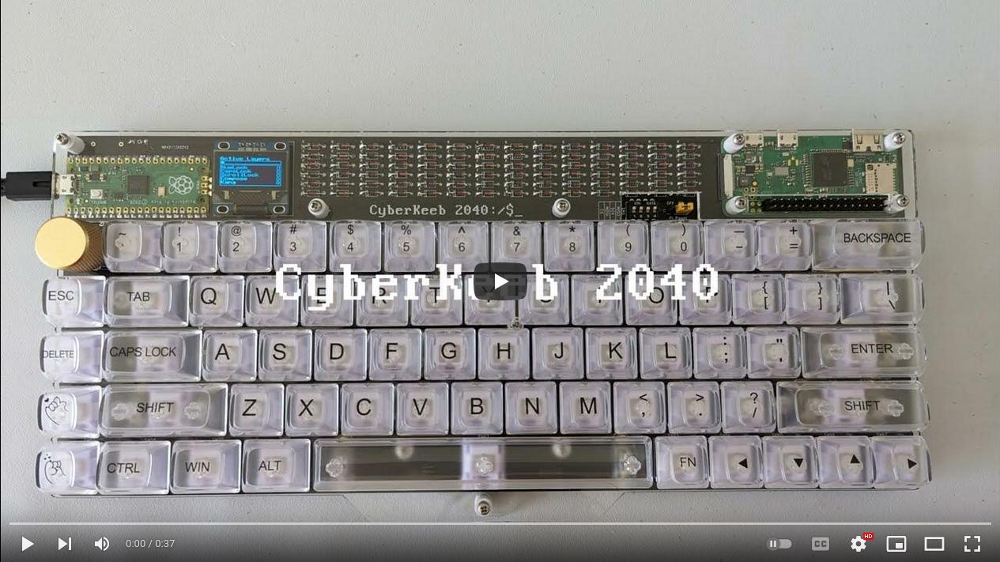
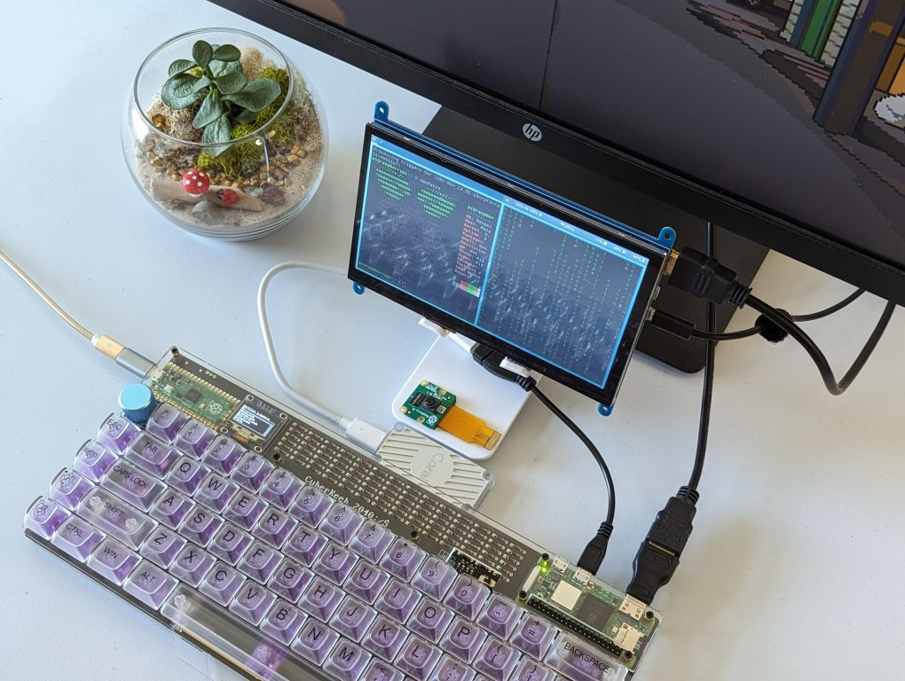
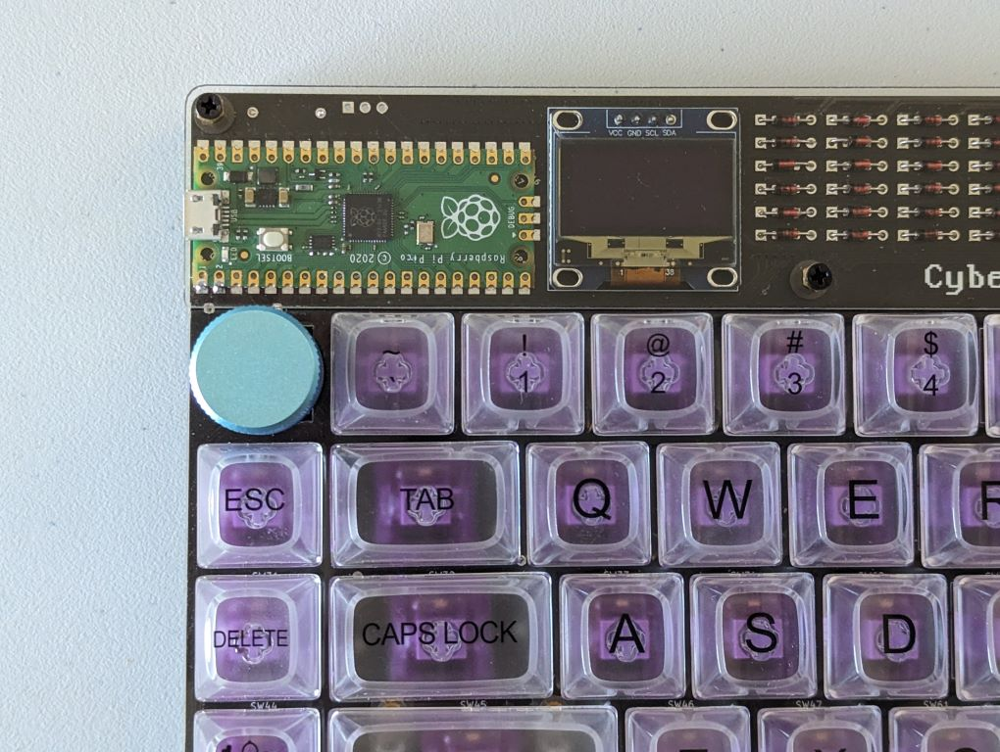
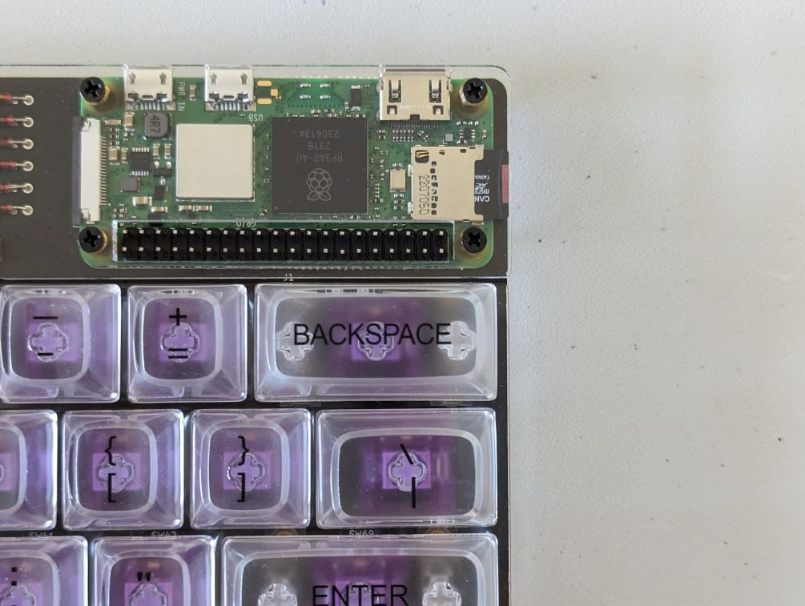
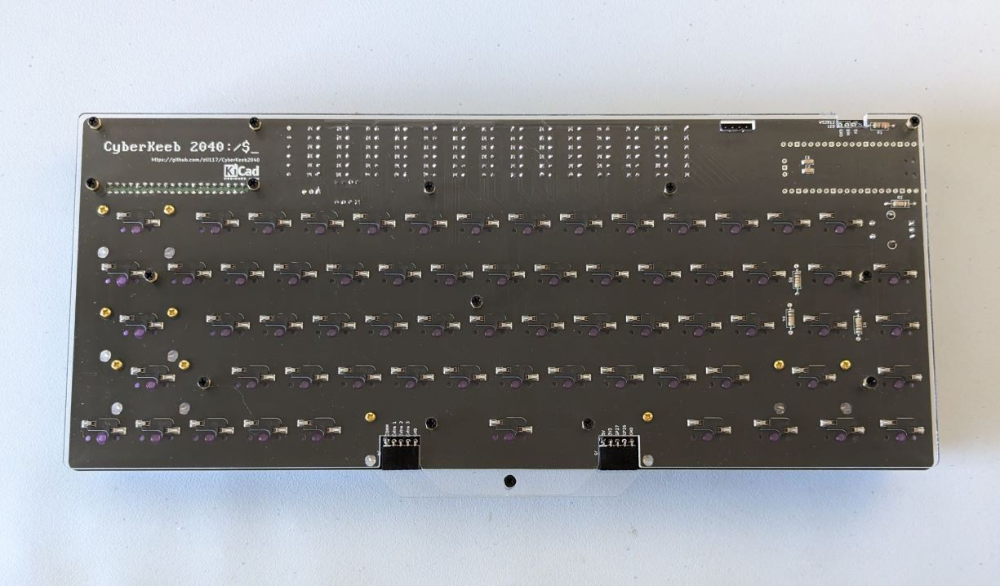
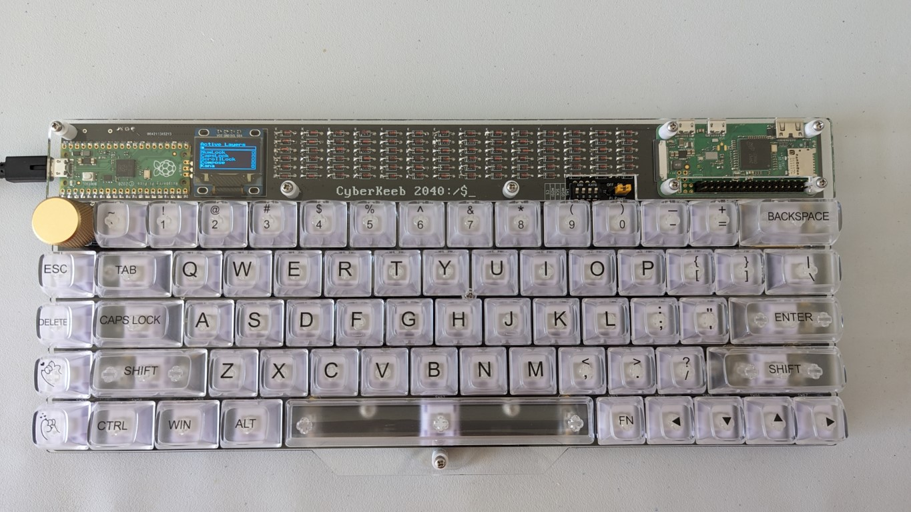
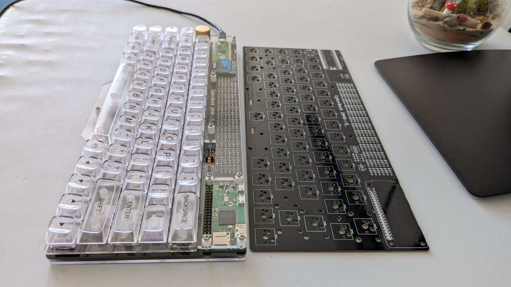
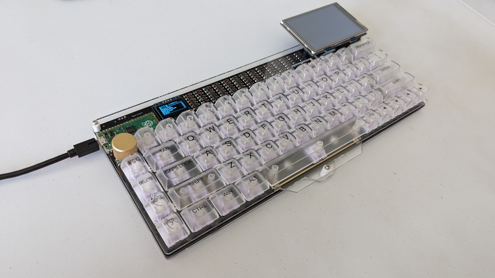

# CyberKeeb 2040
A mechnical keyboard and a cyberdeck. Powered by [PicoMK](https://github.com/zli117/PicoMK) for communication between RP2040 and Pi Zero. Watch the demo on YouTube 👇.

# Table of Contents

- [CyberKeeb 2040](#cyberkeeb-2040)
- [Table of Contents](#table-of-contents)
- [Build Instructions](#build-instructions)
- [Photos](#photos)
  - [V2](#v2)
  - [V1](#v1)
- [Q\&A](#qa)
- [PCB Library Licenses](#pcb-library-licenses)

# [Build Instructions](Docs/BuildInstructions_V2.md)

[V2 build instructions](Docs/BuildInstructions_V2.md)

[V1 build instructions](Docs/BuildInstructions_V1.md)

# Photos

## V2

## V1

# Q&A

Special thanks to [icon-oclast](https://github.com/icon-oclast) for [asking](https://github.com/zli117/CyberKeeb2040/issues/2) these great questions.

> What are the dip switches used for? Is there a recommended default setting for these?

The 4 positions are for each line of the SPI connection between the pi pico and pi zero. This allows cutting the connections between pi pico and pi zero without cutting the power connections. I initially designed it for the (paranoid) scenario where I can't kill the pi zero, but doesn't want it to do autotype or receiving the key strokes, but I found such scenario increasing unlikely. So, if you don't want to solder the DIP switches, feel free to just short the corresponding pins.

> Presumably the switch/jumper labeled "pi power" controls pass-through power from the Pico to the Zero?

Yes.

> Is there a minimum USB current needed when powering both boards

I don't have the empirical measurements, but here's the estimate:
Pico: <20mA. Data source: https://mjoldfield.com/atelier/2021/11/pico-power.html
SSD1306: <7mA. Data source: https://hsel.co.uk/2018/12/04/ssd1306-power-consumption/
Pi Zero W: <400mA under stress. Data source: https://www.tomshardware.com/reviews/raspberry-pi-zero-2-w-review
Pi Zero 2 W: <600mA under stress.

So let's say it's 700mA if you want to stress the pi zero. I did run the stressberry on pi zero 2 w, with the display hat, and a wireless mouse receiver. The board is connected to the USB3.0 port and there's no under voltage warning, and no visible heat up on the cable or the connectors. However, due to differences on the motherboards, YMMY. I currently don't have a USB power meter to measure the actual current drawn.

> Is there a maximum safe current to pass-through (when using the optional display hat for example)?

The trace between pico and pi zero has width of 1mm, and length around 300mm. Assuming you're using 1oz copper thickness, it should result in a maximum current of 1.2 A for temperature rise of 10 degree C.

> Is it safe to power the zero independently by setting the pi power switch/jumper to off?

Yes.

> What about the two connectors at the bottom of the board, either 4-pin jst sockets as in the build instructions, or possibly 5-pin headers on some revisions of the pcb, how are they intended to be used?

They are for my future plans :) Essentially, they expose three buttons from the key scan matrix, and pin 26 and 27. Pin 26 and 27 are analog input pins and I2C 1. I'm planning to create a plugin module for the joystick mouse pad similar to the one I have on the Pico-Keyboard, and an I2C expansion board for more modules like a num pad. 

> What cool things can we do if we include the optional 90 degree pin header(s)?

The pin header under the small screen has been removed, because I figured it'll be difficult to use it for anything without creating a giant mess in the firmware. The other header exposes the addressable LEDs. Only WS2812 is supported and tested because it's used in the Pico-Keyboard. However, you might be able to use for other things as it's essentially a GPIO pin with ground and 5V, and a 330 ohm resister on the GPIO pin.

# PCB Library Licenses

 * Pico symbol, footprint from https://github.com/ncarandini/KiCad-RP-Pico under CC-BY-SA 4.0. 3D model for Pico is obtained from Raspberry Pi Foundation.
 * Pi Zero symbol, footprint and 3D model are from [SnapEDA](https://www.snapeda.com/parts/ADA3708/Adafruit%20Industries%20LLC/view-part/) under [CC BY-SA 4.0](https://support.snapeda.com/en/articles/2957814-what-is-the-license-for-symbols-and-footprints)
 * Key switch footprints and 3D models are from https://github.com/kiswitch/kiswitch
 * PJ320A symbol, footprint are from [Keebio-Parts.pretty](https://github.com/keebio/Keebio-Parts.pretty/blob/master/TRRS-PJ-320A.kicad_mod) under MIT License.
 * Other symbols are from KiCad library which is under CC-BY-SA 4.0 license. 

This work is licensed under a
[Creative Commons Attribution-ShareAlike 4.0 International License][cc-by-sa].

[![CC BY-SA 4.0][cc-by-sa-image]][cc-by-sa]

[cc-by-sa]: http://creativecommons.org/licenses/by-sa/4.0/
[cc-by-sa-image]: https://licensebuttons.net/l/by-sa/4.0/88x31.png
[cc-by-sa-shield]: https://img.shields.io/badge/License-CC%20BY--SA%204.0-lightgrey.svg
