# CyberKeeb 2040
A mechnical keyboard and a cyberdeck. Powered by [PicoMK](https://github.com/zli117/PicoMK) for communication between RP2040 and Pi Zero. Watch the demo on YouTube 👇.

[](https://youtu.be/GYs4eybdZCU)

# Table of Contents

- [CyberKeeb 2040](#cyberkeeb-2040)
- [Table of Contents](#table-of-contents)
- [BOM](#bom)
- [Build Instructions](#build-instructions)
  - [PCB](#pcb)
  - [Case](#case)
    - [Step 1: Assemble the rivets and bottom spacers](#step-1-assemble-the-rivets-and-bottom-spacers)
    - [Step 2: Place the top spacers](#step-2-place-the-top-spacers)
    - [Step 3: Secure the top plates with screws](#step-3-secure-the-top-plates-with-screws)
  - [Soldering](#soldering)
    - [Pi Zero](#pi-zero)
    - [Diodes](#diodes)
    - [JST Connector](#jst-connector)
    - [JMD0.96C OLED Display (Marked as J4 on the front of the PCB)](#jmd096c-oled-display-marked-as-j4-on-the-front-of-the-pcb)
  - [Software](#software)
- [Photos](#photos)
- [PCB Library Licenses](#pcb-library-licenses)

# BOM
| Component | Count |
| ------------- | ------------- |
| Pi Pico  | 1 |
| Pi Zero W or Pi Zero 2 W  | 1 |
| Pi Zero 2x20 Header Pins  | 1 |
| SD Card  | 1 |
| JMD0.96C OLED Display | 1 |
| 4 Position DIP Switch | 1 |
| 0.1" 3 Pin Header + Jumper / 0.1" Pitch SPDT Slide Switch | 1 |
| Hotswap Socket | 66 |
| Keyboard Switch (Hippo Linear) | 66 |
| Keycaps (Redragon Crystal Keycap) | 66 |
| EC11 Rotary Encoder | 1 |
| Encoder Knob (Glorious) | 1 |
| 1N4148 Diode | 84 |
| M2.6 x 10mm Self Tapping Screws | 8 |
| M2.6 x 16mm Self Tapping Screws | 7 |
| 3mm Acrylic Sheet | 2 |
| 1.5mm Acrylic Sheet | 1 |
| 3D Printed Rivet + Spacers | 15 |
| JST-PH 2.0mm 4 Pin Female Connector | 2 |
| Stablizer Set | 1 |
| 330Ω THT Resister | 1 |
| 10kΩ THT Resister | 4 |
| 1206 0.01 µF Capacitor | 2 |
| (Optional) 3.5 inch TFT Display HAT | 1 |
| (Optional) 0.1" 3 Pin 90° Header | 1 |
| (Optional) 0.1" 4 Pin 90° Header | 1 |

# Build Instructions

## PCB
Everything is in [PCB/MainBoard](PCB/MainBoard) dir. Designed with Kicad 7.0. Make sure `Perfect DOS VGA 437 Font` is intalled on Windows, or if you use Arch, install the [ttf-perfectdos](https://aur.archlinux.org/packages/ttf-perfectdos) package. [PCB/MainBoard/Gerber](PCB/MainBoard/Gerber) dir contains the Gerber files for three fab houses: [JLCPCB](PCB/MainBoard/Gerber/JLCPCB/), [PCBWay](PCB/MainBoard/Gerber/PCBWay/), and [OSHPark](PCB/MainBoard/Gerber/OSHPark/). For JLCPCB and PCBWay, **make sure to select the Castellated Holes option** (this will increase the price, but it's better to be safe on the quality side).

## Case
The case comprises three acrylic plates and various 3D printed rivets. The original Fusion 360 archive is `Frame/MainBoard/CyberKeep 2040 V2 v34.f3d`. The spacer heights are parameterized.

 * [Frame/MainBoard/TopBar.dxf](Frame/MainBoard/TopBar.dxf): 3mm acrlyic
 * [Frame/MainBoard/Plate.dxf](Frame/MainBoard/Plate.dxf): 1.5mm acrlyic
 * [Frame/MainBoard/Bottom.dxf](Frame/MainBoard/Bottom.dxf): 3mm acrlyic

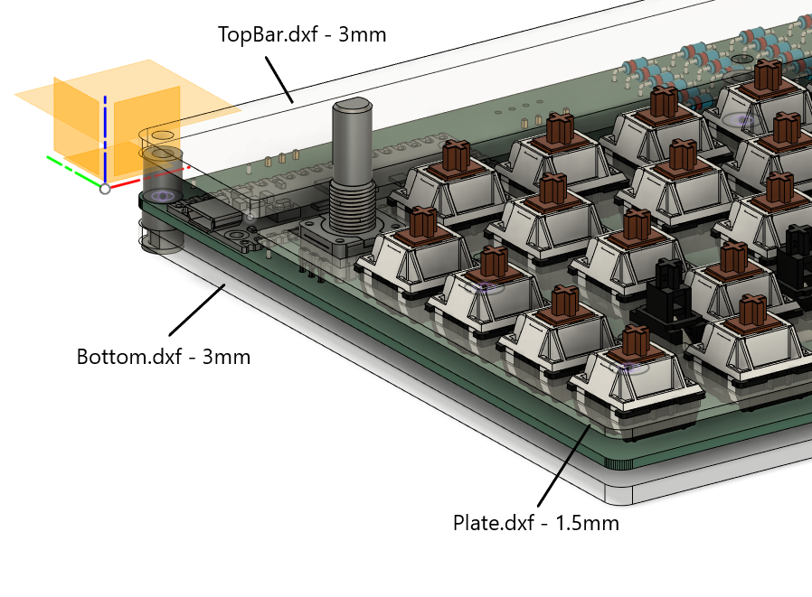

The case is held together with 3D printed rivets and spacers.

### Step 1: Assemble the rivets and bottom spacers
Place the rivets through the holes on the bottom place. Then fit the spacer rings.
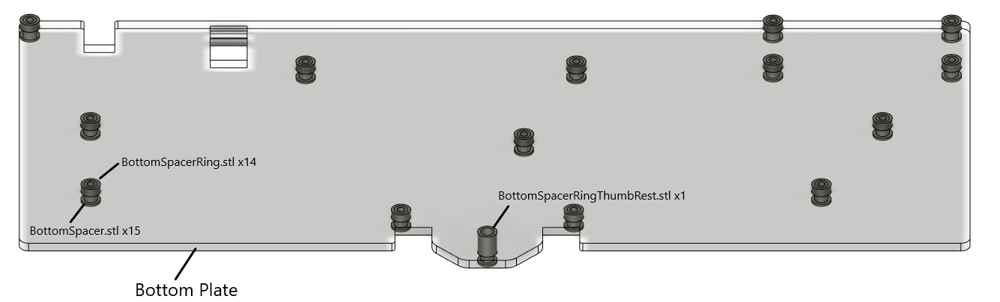

### Step 2: Place the top spacers
Place the PCB on top of the bottom spacers. Then place the top spacers as shown.
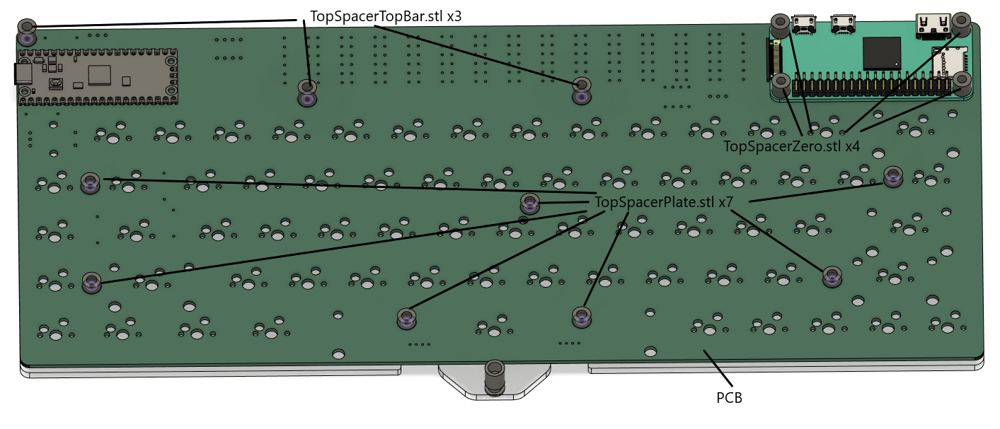

### Step 3: Secure the top plates with screws
Place the top bar acrylic plate and the switch plate on top of the top spacers. Then secure the whole assembly with screws. Use M2.6x16mm screws for the top plate, and M2.6x10mm screws for the switch plate.
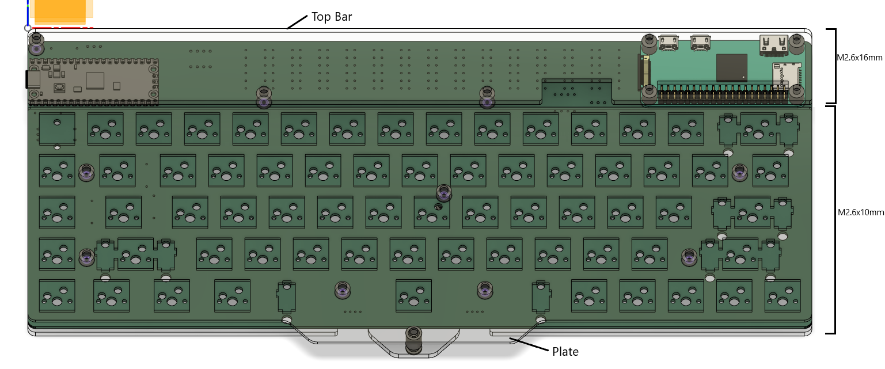

## Soldering

### Pi Zero
Soldering of Pi Zero is the trickiest. You need to solder the pins simultaneously to the keyboard PCB and the Pi Zero, via the castellated hole on the PCB. 

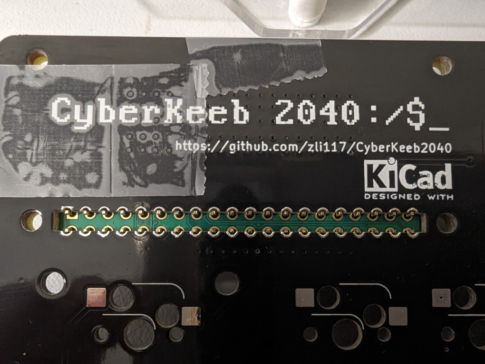

This is viewed from the bottom, at the castellated hole. The green PCB is Pi Zero. Solder joint should form between the copper on the keyboard PCB, the plates on Pi Zero PCB and the pin. To make things easier, it's recommended to tape down the Pi Zero and headers:

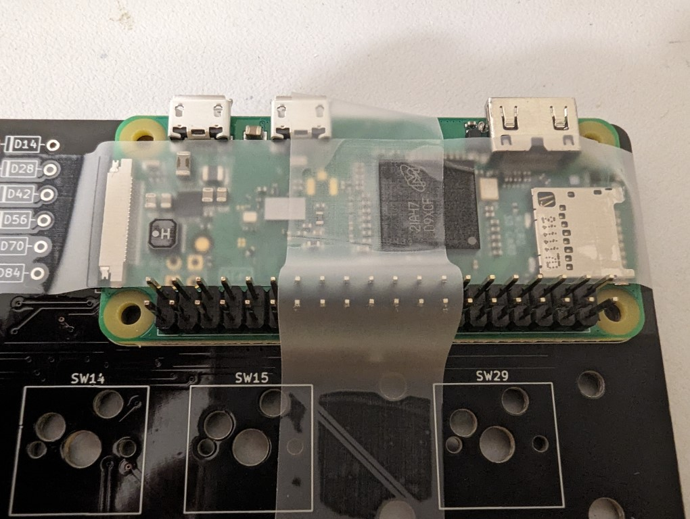

It's also recommended to solder all the pins for structural strength.

### Diodes
Align the dark side of the diode with the square pad.

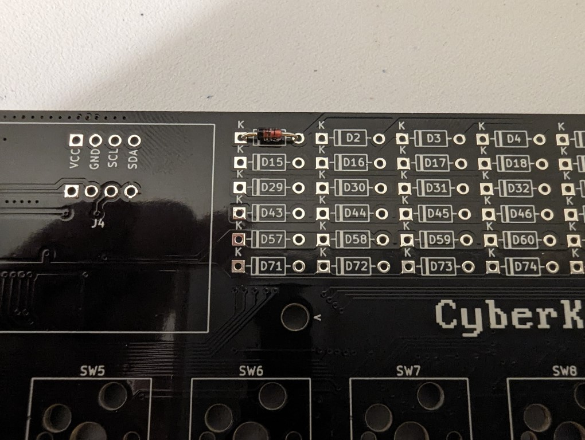

### JST Connector
Install the JST connectors on the back of the PCB. You can either solder on the back side or on the front. If on the front, tape down the connectors first.

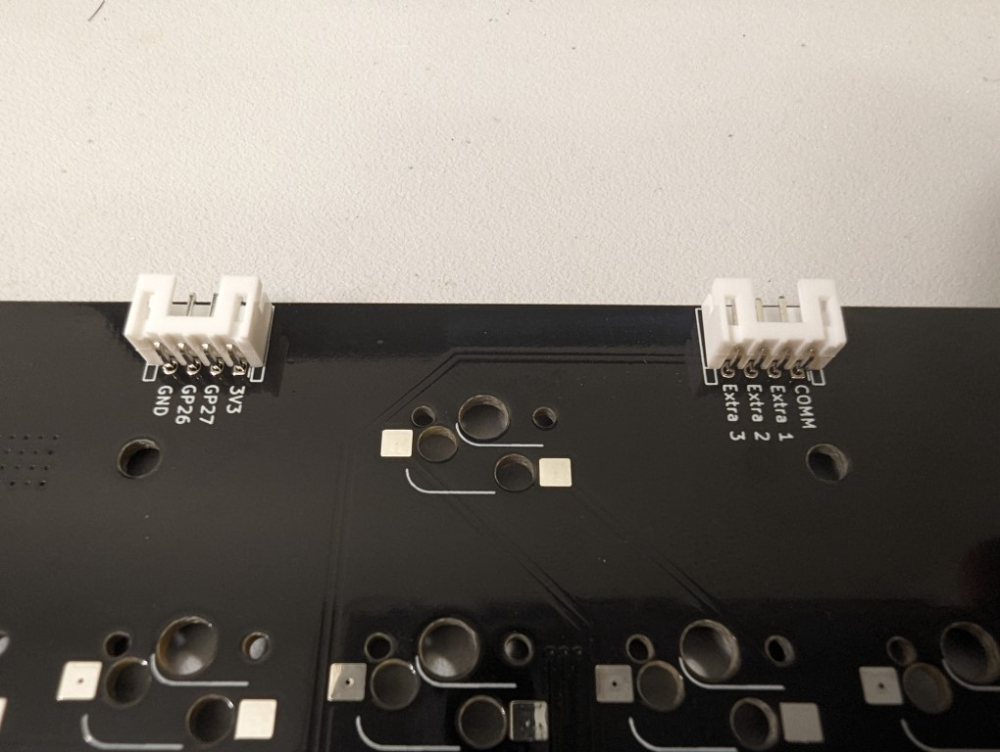

### JMD0.96C OLED Display (Marked as J4 on the front of the PCB)

If J3 is installed on the back of the PCB, place a tape on the back of the display to avoid shorting.

## Software

Keyboard firmware: https://github.com/zli117/PicoMK/tree/main/configs/cyberkeeb_2040. Follow PicoMK's [instruction](https://github.com/zli117/PicoMK/tree/main#build-a-firmware) to build the firmware and upload it to Pico microcontroller.

Linux driver for accepting key strokes from SPI: (You'll need an external screen and an external keyboard for this setup)
 1. Install kernel headers: `sudo apt install raspberrypi-kernel-headers` 
 2. Checkout PicoMK: `git clone https://github.com/zli117/PicoMK.git`
 3. Build the driver and device tree overlay:
    ```bash
    cd PicoMK/linux
    make -j
    make device_tree
    ```
 4. Install the driver: 
    ```bash
    sudo -E make install
    sudo depmod -a
    ```
 5. Copy over the device tree overlay: `sudo cp spi1-picomk.dtbo /boot/overlays`
 6. Add this line to the `config.txt`. Make sure SPI1 is not enabled. 
    ```
    dtoverlay=spi1-picomk
    ``` 
 7. Add this line to the `/etc/modules` file:
    ```
    spi_picomk
    ```

 If you're using the 3.5 inch TFT screen, you can install the driver from https://github.com/juj/fbcp-ili9341.

# Photos

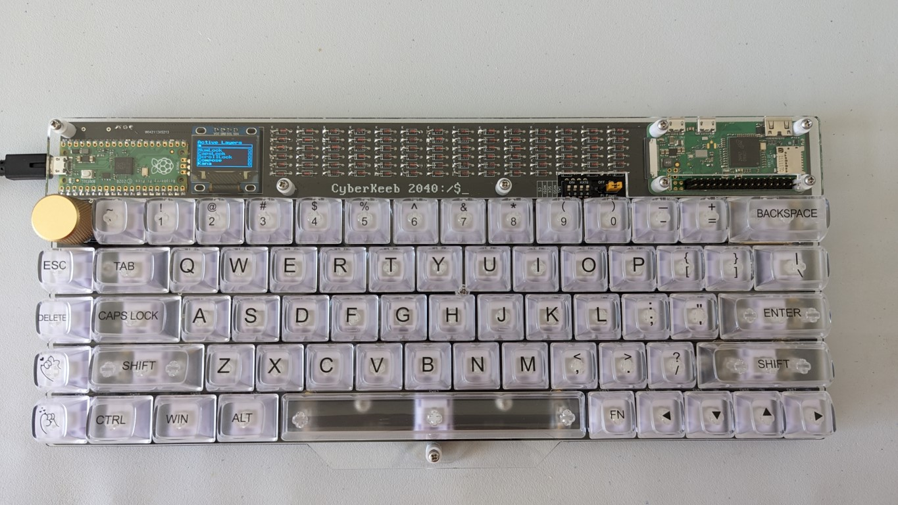
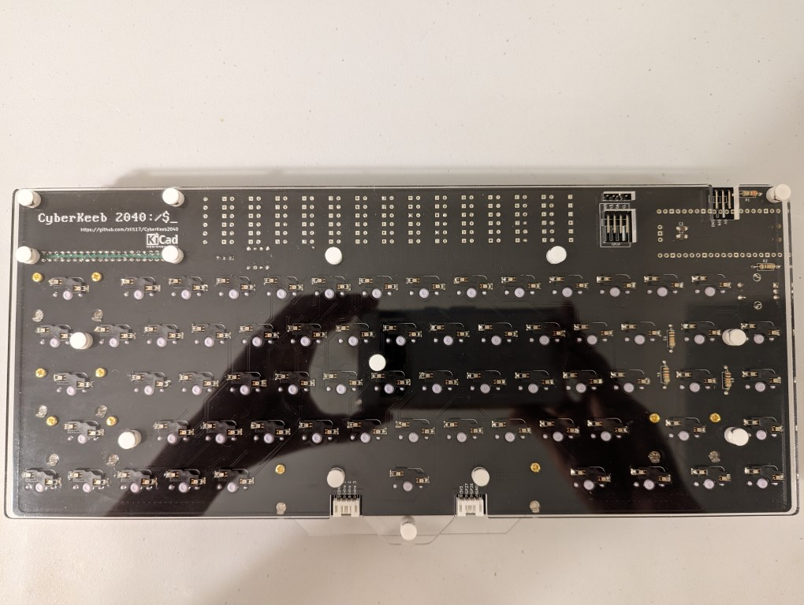
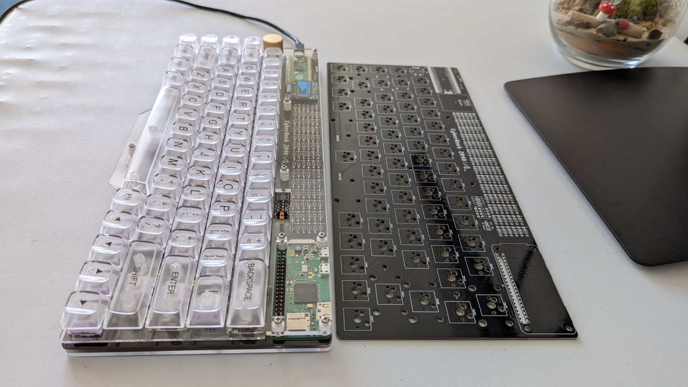
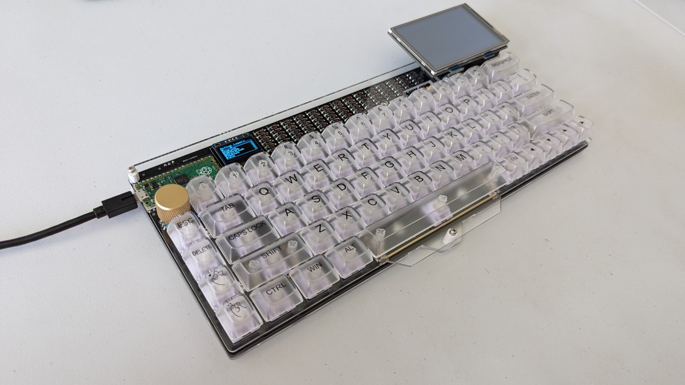
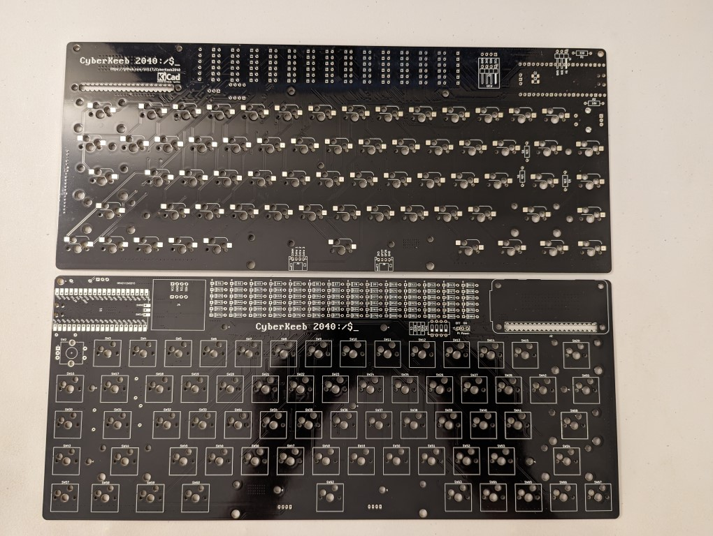

# PCB Library Licenses

 * Pico symbol, footprint from https://github.com/ncarandini/KiCad-RP-Pico under CC-BY-SA 4.0. 3D model for Pico is obtained from Raspberry Pi Foundation.
 * Pi Zero symbol, footprint and 3D model are from [SnapEDA](https://www.snapeda.com/parts/ADA3708/Adafruit%20Industries%20LLC/view-part/) under [CC BY-SA 4.0](https://support.snapeda.com/en/articles/2957814-what-is-the-license-for-symbols-and-footprints)
 * Key switch footprints and 3D models are from https://github.com/kiswitch/kiswitch
 * PJ320A symbol, footprint are from [Keebio-Parts.pretty](https://github.com/keebio/Keebio-Parts.pretty/blob/master/TRRS-PJ-320A.kicad_mod) under MIT License.
 * Other symbols are from KiCad library which is under CC-BY-SA 4.0 license. 

This work is licensed under a
[Creative Commons Attribution-ShareAlike 4.0 International License][cc-by-sa].

[![CC BY-SA 4.0][cc-by-sa-image]][cc-by-sa]

[cc-by-sa]: http://creativecommons.org/licenses/by-sa/4.0/
[cc-by-sa-image]: https://licensebuttons.net/l/by-sa/4.0/88x31.png
[cc-by-sa-shield]: https://img.shields.io/badge/License-CC%20BY--SA%204.0-lightgrey.svg
